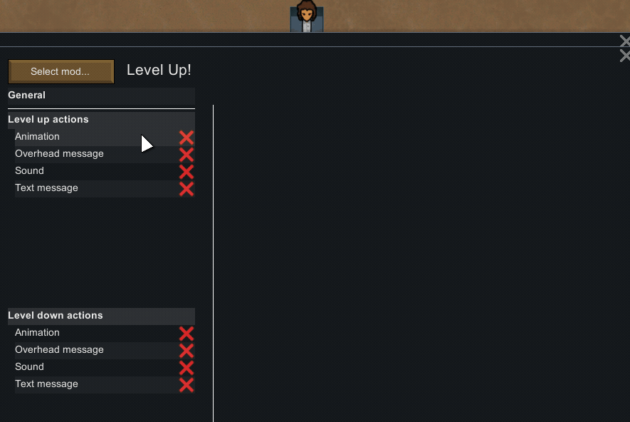

# Level Up

**Level Up** is a RimWorld mod for customizing how you are notified about colonists leveling up.

## Installation

Subscribe to the mod on [Steam Workshop](https://steamcommunity.com/sharedfiles/filedetails/?id=1701592470) or download the latest release [from here](https://github.com/krafs/LevelUp/releases/latest) and unzip in your Rimworld/Mods-folder.

Start the game and enable the mod in the Mod menu. 

Place anywhere below **Core** and **Harmony** ([Github](https://github.com/pardeike/HarmonyRimWorld) / [Steam Workshop](https://steamcommunity.com/sharedfiles/filedetails/?id=2009463077)).

## Compatibility
**Level up** is compatible with RimWorld **v1.3**.

It is incompatible with mods **Static Quality Plus** and **Ducks' Insane Skills**.

## Usage
Start the game and go to **Mod Settings** for **Level Up**. Here, enable the actions you want executed whenever a colonist levels up or down.

### Actions
An **Action** is something that happens when a colonist levels up or down. Any number of actions can be enabled at the same time.

#### Sound
Plays a sound.

#### Message
Display a message in the top-left corner of the screen.

#### Overhead message
Displays a message on top of the leveling colonist. 

This is the same as vanilla, but Level up allows you to customize the message.

#### Animation
Displays a simple animation on top of the leveling colonist.

## For modders
**Level Up** also acts as a small framework for modders. You can make your own mod with custom sounds and animations that will appear in Level Up's settings. All it takes is a little xml. You can read more about that [here](Docs/ForModders.md).

## FAQ
#### Why do colonists level up and then almost instantly down again?
This is caused by a feature in vanilla RimWorld known as *skill decay*. Skills at lvl 10 and higher lose xp. If xp goes low enough, the skill levels down. The rate of skill decay increases with every level - It is slow at lvl 10, and fast at lvl 20.
This can lead to two problems:

- A colonist on level 10 or higher in a skill she almost never uses will lead to that skill almost always ending up at the very top of lvl 9, because skill decay stops as soon as a skill goes below lvl 10. This means that only a tiny bit of xp is needed to level her up to lvl 10 again, which then goes down to 9 again, and so on.

- A colonist with a high level skill she uses almost all the time will likewise lead to that skill jumping up and down between e.g. lvl 19 and 20.

Level Up has a cooldown between actions to make this feel less irritating, but it does not in any way prevent or slow down skill decay.

## Contributing
Pull requests are welcome, for both code and translations. 
For major code changes, please open an issue first to discuss what you would like to change.

## License
[MIT](https://choosealicense.com/licenses/mit/)